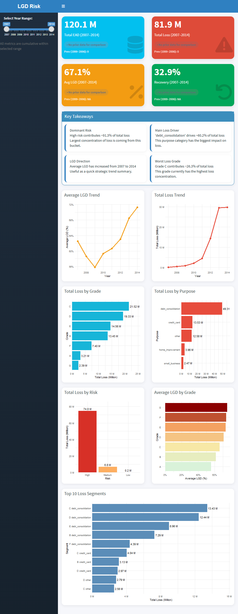

# 📊 Credit Risk LGD Model Selection
This project demonstrates how stability and interpretability can outweigh raw accuracy in real-world credit risk modeling.

---

## 📌 1. Overview
This project develops and evaluates multiple models to estimate **Loss Given Default (LGD)**.

The goal is not only to achieve high predictive performance, but to select a model that is **stable, interpretable, and suitable for real-world credit risk applications**.

---

## 📂 2. Dataset

This project uses publicly available loan data from Kaggle:

- 📌 Dataset: Loan Data for Credit Risk Modeling  
- 🔗 https://www.kaggle.com/datasets/shawnysun/loan-data-for-credit-risk-modeling  

The dataset includes borrower characteristics, loan details, repayment behavior, and recovery information, which are used to construct the **Loss Given Default (LGD)** target. In addition to the original source on Kaggle, the dataset is also included in this repository in ZIP format. This allows users to easily access and reproduce the analysis without needing to download the data separately from Kaggle.

#### 📌 Data Usage
- File used: `loan_data_defaults.csv`
- LGD derived using discounted recovery cash flows
- Feature engineering applied (e.g., utilization, zip grouping)

#### ⚠️ Disclaimer
- This dataset is publicly available on Kaggle  
- Used for educational and modeling purposes only  

---

## ⚙️ 3. Project Workflow

### 3.1. Data Preparation
- Construct LGD using discounted recovery cash flows to reflect true economic loss  
- Clean and preprocess data, including handling missing values, correcting inconsistencies, and capping extreme values  
- Perform feature engineering to improve model performance:
  - Utilization ratio to capture borrower credit behavior  
  - Zip code grouping to reduce dimensionality  
  - Financial transformations such as discount factor calculation  
- Ensure all variables are consistent and suitable for modeling  

📄 Script: `LGD EDA + Big Picture.R`

---

### 3.2. Exploratory Data Analysis (EDA)
- Analyze variable distributions to understand data patterns and LGD behavior  
- Examine relationships between features and LGD to identify key risk drivers  
- Explore differences across segments such as credit grade, purpose, and income level  
- Detect missing values, data quality issues, and outliers  
- Generate insights to support feature selection and modeling strategy

📄 Script: `LGD EDA + Big Picture.R`

---

### 3.3. Model Development

To ensure a balanced evaluation between interpretability, stability, and predictive performance, three modeling approaches were selected, representing both traditional statistical techniques and advanced machine learning methods.

---

#### A. **Linear Regression (Baseline Model)**
A standard linear regression model was used as a performance benchmark.

- Provides a simple and transparent framework to understand linear relationships between predictors and LGD  
- Highly interpretable, enabling clear attribution of model outputs to input variables  
- However, limited in capturing non-linear relationships and interactions across features  

This model serves as a reference point to assess the incremental value of more advanced approaches.

---

#### B. **WOE Logistic Regression (Industry Standard)**
A logistic regression model enhanced with **Weight of Evidence (WOE)** transformation, widely adopted in credit risk modeling.

- Transforms variables into a monotonic and statistically robust format  
- Ensures alignment with credit risk modeling best practices  
- Highly interpretable and suitable for regulatory and business communication  
- More stable under population shifts compared to purely data-driven models  

This approach balances predictive performance with strong interpretability and robustness, making it well-suited for real-world deployment.

---

#### C. **LightGBM (Machine Learning Approach)**
A gradient boosting framework designed to capture complex, non-linear patterns in the data.

- Efficiently models interactions and non-linear relationships across variables  
- Typically delivers strong predictive performance in large and complex datasets  
- However, less transparent and more challenging to interpret in a business context  
- More sensitive to data shifts, requiring careful validation and monitoring  

This model represents a high-performance benchmark, particularly for assessing the upper bound of predictive capability.

---

**Overall, the selected models provide a structured comparison across a spectrum of modeling philosophies—ranging from interpretable statistical methods to high-performance machine learning techniques.**

📄 Script: `LGD Backtesting (Modeling & Validation).R`

---

### 3.4. Model Validation

#### A. Backtesting Framework
* **Time-based train-test split**
* **Out-of-Time (OOT) validation**
* **Shuffle validation**

#### B. Model Evaluation Metrics
* **Accuracy:** RMSE, MAE, MAPE
* **Discrimination:** ROC AUC, KS, Gini
* **Stability & Risk:** Bias, Error distribution, Population Stability Index (PSI), P95 tail risk

#### C. Calibration
* **Bias Correction**
* **LGD Alignment**

📄 Script: `LGD Backtesting (Modeling & Validation).R`

---

### 3.5. Insights & Business Action
* Actionable Recommendations
* Optimized Strategy
* Continuous Improvement
* Data-Driven Impact

📄 Script: `LGD Business Summary (WOE).R` & `LGD Business Dashboard.R`

#### ▶️ Execution Note

To reproduce the final business results and dashboard:

1. Run:LGD Business Summary (WOE).R
2. Then run: LGD Business Dashboard.R

⚠️ Important: Always run **Business Summary → Dashboard**, as the dashboard depends on the generated output data.

---

## 🏆 4. Final Model Selection
 The table below summarizes model performance after data cleaning and out-of-time (OOT) validation.
### 📊 Model Performance Summary
| Metric          | Linear Regression | WOE Logistic Regression | LightGBM |
|----------------|------------------|----------------|----------|
| **RMSE (OOT)** | 0.0771           | **0.0762 ✅**  | 0.0785   |
| **MAE (OOT)**  | 0.0589           | **0.0583 ✅**  | 0.0598   |
| **MAPE (OOT)** | 7.46%            | **7.39% ✅**   | 7.57%    |
| **AUC (OOT)**  | 0.667            | **0.675 ✅**   | 0.668    |
| **Gini (Test)**| 0.3355           | **0.3519 ✅**  | 0.3360   |
| **KS Statistic**| 0.2577          | 0.2595         | **0.2628** |
| **PSI**        | 0.1836 ⚠️        | **0.1132 ✅**  | 0.1787 ⚠️ |

---

### ✅ Selected Model: **WOE Logistic Regression**

After evaluating predictive performance, discriminatory power, and model stability, WOE Logistic Regression was identified as the most suitable model for LGD estimation.

The model consistently outperformed the alternatives across key Out-of-Time (OOT) validation metrics, including RMSE, MAE, MAPE, AUC, and Gini. In addition, it achieved the lowest PSI value, indicating stronger robustness against population shifts and better long-term reliability.

While LightGBM demonstrated competitive predictive performance, it was not selected due to its weaker stability and limited interpretability. The model exhibited higher PSI values, indicating greater sensitivity to population shifts, which may impact robustness over time.

In addition, its black-box nature makes it less suitable for regulatory environments where model transparency and explainability are critical. As a result, despite its strong predictive capability, LightGBM was deemed less appropriate for real-world credit risk deployment.

Given its combination of predictive strength, stability, and interpretability, WOE Logistic Regression was selected as the final model for deployment and business decision-making.

This reinforces the importance of prioritizing model governance, stability, and interpretability over marginal gains in predictive accuracy.

# 📊 5. Credit Risk LGD Analysis & Business Insights

## 📊 5.1. Key Takeaways

Based on loan data from **2007 to 2014**:

- The portfolio shows a **high Loss Given Default (~67%)**, indicating significant loss severity.  
- The **recovery rate is low (~33%)**, meaning most defaulted exposure is not recovered.  
- From total exposure of **120 million**, approximately **82 million is expected to be lost**.  
- Losses are concentrated in **mid-to-high credit grades (C–E)**.  
- **Debt consolidation loans dominate loss contribution**, making them a major risk driver.  
- LGD increases consistently across credit grades, confirming strong **risk differentiation**.  
- The portfolio is heavily concentrated in **high-risk segments (~99%)**, indicating concentration risk.  
- A small number of **grade-purpose combinations drive a disproportionate share of losses**.  
---

## 📊 5.2. Business Summary

The portfolio is exposed to **substantial credit risk**, driven by high loss severity and weak recovery performance.

With expected losses approaching **70% of total exposure**, the portfolio is highly sensitive to default events.

### Key Implications:

- **High Loss Severity**  
  Defaults result in significant unrecovered exposure  

- **Low Recovery Efficiency**  
  Recovery processes are not sufficient to offset losses  

- **Risk Concentration**  
  Losses are concentrated in specific credit grades and loan purposes  

- **Portfolio Imbalance**  
  Overexposure to high-risk segments reduces resilience  

Overall, the portfolio requires **strategic adjustments** to improve profitability and reduce risk.

---

## 💼 5.3. Business Recommendations

### 1. Strengthen Risk-Based Pricing
- Adjust pricing for high LGD segments  
- Align returns with risk exposure  
- Integrate LGD into pricing frameworks  

---

### 2. Tighten Credit Underwriting
- Apply stricter criteria for:
  - Grades C–E  
  - High-risk loan purposes  
- Strengthen income and DTI validation  
- Limit exposure for high-risk borrowers  

---

### 3. Enhance Recovery Strategy
- Improve post-default collection processes  
- Focus on high-exposure accounts  
- Use analytics to optimize recovery prioritization  

---

### 4. Reduce Portfolio Concentration Risk
- Rebalance toward lower-risk segments (A–B)  
- Diversify loan purposes  
- Limit concentration in high-loss categories  

---

### 5. Implement Ongoing Risk Monitoring
- Track LGD and expected loss by segment  
- Build early warning indicators  
- Monitor portfolio risk trends  

---

## 📈 5.4. Business Impact
- Provides reliable LGD estimates
- Supports:
  - Risk-based pricing
  - Credit decision-making
  - Capital allocation
- Reduces model risk under changing economic conditions

---

## 📊 6. Dashboard Overview

An interactive dashboard is developed to visualize LGD results and business insights based on data from **2007–2014**.

### Key Features:
- Portfolio-level KPIs: Total EAD, Total Loss, Average LGD, and Recovery Rate  
- Dynamic trend indicators showing both absolute change and percentage growth  
- Advanced KPI comparison using:
  - Percentage change for volume-based metrics (EAD, Loss)
  - Percentage point (pts) change for rate-based metrics (LGD, Recovery)  
- Automated key takeaways summarizing critical portfolio insights directly below KPIs  
- Interactive year range slider enabling flexible analysis from 2007 to 2014  
- Time-series visualization of LGD and loss trends  
- Loss decomposition by credit grade and loan purpose  
- Risk segmentation across High, Medium, and Low risk categories  
- Identification of top loss-driving segments  

📸 Example Dashboard:

## 🛠️ 7. Tools & Technologies
- R
- data.table, dplyr
- scorecard (WOE Logistic Regression)
- lightgbm
- ggplot2

---

## ⚠️ 8. Notes
- Dataset is available via Kaggle (link above)
- Update file path before running the script
- Project is intended for learning and demonstration purposes

---

## 👤 9. Author
Dylan Richard
